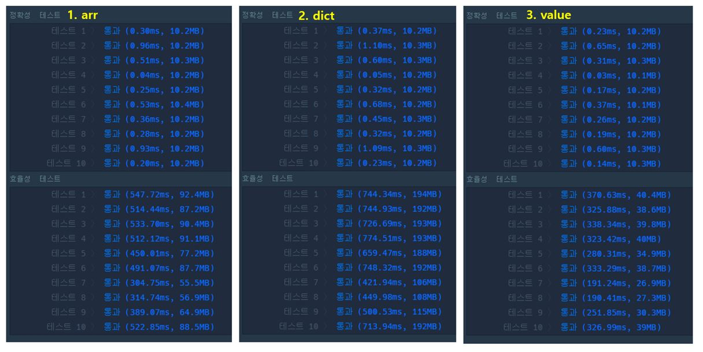

### DP 문제 해결

#### 1. 프로그래머스 2 X n 타일링 문제

[프로그래머스 2 X n 타일링 문제링크](https://programmers.co.kr/learn/courses/30/lessons/12900)

```python
def solution(n):
    a, b = 1, 2
    if n == 1:
        return a
    if n == 2:
        return b

    for _ in range(3, n+1):
        a, b = b, a+b

    return b % 1000000007
```

#### 2. 프로그래머스 도둑질 문제

[프로그래머스 도둑질 문제링크](https://programmers.co.kr/learn/courses/30/lessons/42897)

- i번째 집까지 털었을 경우, 최댓값을 배열에 저장

```python
def solution(money):
    N = len(money)

    dp1 = [0]*N # 첫번째 집을 훔칠 경우, 마지막 집은 훔칠수 없음
    dp1[0] = money[0]
    dp1[1] = money[0]

    dp2 = [0]*N # 두번째 집을 훔칠 경우, 마지막 집까지 훔칠 수 있음
    dp2[1] = money[1]

    for i in range(2, N-1):
        dp1[i] = max(dp1[i-1], dp1[i-2] + money[i])
        dp2[i] = max(dp2[i-1], dp2[i-2] + money[i])

    dp1[N-1] = dp1[N-2] # 마지막 집 제외
    dp2[N-1] = max(dp2[N-2], dp2[N-3] + money[N-1]) # 마지막 집 훔쳤을 경우와 비교

    return max(dp1[N-1], dp2[N-1])
```

- 최댓값 계산에 필요한 두 값만 저장

```python
def solution(money):
    N = len(money)

    dp1_a, dp1_b = money[0], money[0] # case1) 첫번째 집 훔쳤을 경우 > 마지막 집 전까지 최댓값 확인
    dp2_a, dp2_b = 0, money[1] # case2) 두번째 집 훔쳤을 경우

    for i in range(2, N-1):
        dp1_a, dp1_b = dp1_b, max(dp1_b, dp1_a + money[i])
        dp2_a, dp2_b = dp2_b, max(dp2_b, dp2_a + money[i])

    dp2_b = max(dp2_b, dp2_a + money[N-1]) # 마지막 집 훔쳤을 경우와 비교

    return max(dp1_b, dp2_b)
```

- **테스트 결과 비교**

효율성 테스트에서 array 보다 두 값만 저장했을 때 좋은 결과를 보인다.


